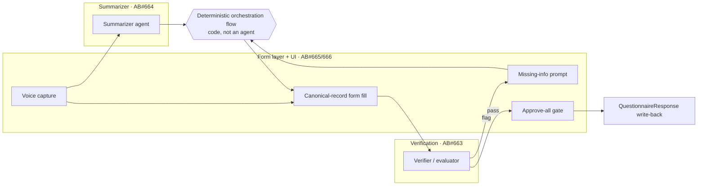

# Architecture Decomposition — Loop

**For:** the architect cutting and assigning work. **Companion docs:** `docs/design/DESIGN.md`
(scope & why), `docs/adr/` (decisions). **The code is the authoritative interface spec** —
`backend/main.py` defines the HTTP contracts; `backend/schema.py` + `backend/office/forms.py`
define the data models.

> This doc carries the durable decomposition (quantum, characteristics, components, seams) and,
> from `2026-06-20`, the **ADR-0005 agent-farm addendum** (Work Stream 5 + agent-farm seams).
> Tracking: **AB#662**.

---

## 0. TL;DR
One **architecture quantum** — a local **modular monolith**. Decompose *logically* along the
existing module seams + HTTP/Pydantic contracts; do **not** split into services. Top-3 driving
characteristics: **auditability, privacy/locality, simplicity**.

## 1. Scope & quantum
Single independently-deployable app, runs locally, one SQLite store, synchronous internal calls
→ **one set of characteristics → modular monolith**, not microservices. Decomposition is
**logical (modules)**, not physical (services). Don't reach for a distributed style.

## 2. Driving architecture characteristics (top 3 starred)
- ★ **Auditability / explainability** — the whole safety story; drives "source-backed + evidence
  + confidence + physician-review," nothing the AI emits is unsourced.
- ★ **Privacy / data locality** — no PHI leaves the machine, local model, synthetic data only.
- ★ **Simplicity / feasibility** — no heavy infra, laptop-deployable, deterministic fallbacks.
- **Modularity** — the port seams (swap FHIR source / model / form; parallelize the team).
- **Reliability / demonstrability** — the mock/deterministic fallbacks (demo can't fail).
- *Not drivers:* scalability, performance, elasticity. **Do not optimize for them.**

## 3. Logical components
Leaf modules are the components; names are functional (no `Manager`/`Engine` dumping grounds).
Architecture style: **layered** (API → service → modules; modules never import the API).

| Component (module) | Single responsibility | Depends on |
|---|---|---|
| API (`backend/main.py`) | HTTP boundary; route to services | fhir.service, office.service, llm |
| FHIR · client/normalize/store/diff/summarize | scan → snapshot → diff → safe summary | httpx, sqlite3, (optional) Ollama |
| FHIR · service | orchestrate the FHIR pipeline | the FHIR modules |
| FHIR · action_builder/writer | build + write Task / QuestionnaireResponse (gated) | `WRITE_ENABLED`, FHIR base |
| Office · necessity | route a request (eliminate/delegate/automate/review) | — |
| Office · forms | **canonical record + form registry + prefill** | schema |
| Office · referral_intel | specialist scope-match + rejection-risk | (mock directory) |
| Office · field_drafter | draft flagged clinical fields with evidence + confidence | llm, schema |
| Office · metrics | saved-minutes / touchpoints / FTE | — |
| Office · service | orchestrate triage → prefill → approve | necessity, forms, metrics, llm |
| Extractor (`schema` + `llm` + `mock`) | note → `EncounterExtraction` (+ fallback) | (optional) Ollama |
| UIs (`frontend/`) | `index.html` (follow-up), `office.html` (office wizard) | the HTTP API |

## 4. The seams (contracts teams work behind)
Keep cross-boundary coupling weak — JSON/Pydantic (Name/Type connascence only).

- **HTTP API** — `backend/main.py` (the integration contract; freeze it early).
- **Data models** — `EncounterExtraction` (`backend/schema.py`); the canonical
  `FunctionalLimitations` record + form registry (`backend/office/forms.py`); FHIR resource JSON.
- **Ports (swappable)** — FHIR source (fixtures ↔ live HAPI/Synthea); LLM (Ollama ↔
  mock/deterministic); storage (SQLite).

## 5. Fitness functions (keep the decomposition honest)
- **No cyclic dependencies** across `core ↔ fhir ↔ office`; modules must not import the API layer.
- **"AI invents nothing"** — clinical-judgement fields are structurally flagged for the physician,
  never auto-filled; the safety post-filter rejects model text with clinical wording.
- Keep the **mock/deterministic fallback paths** working; cyclomatic complexity modest (≤10).
- *(ADR-0005, added below)* evidence-or-flag on every emitted field; verifier-pass before MD
  review; write-back only via the approval gate; no model call selects a workflow step.

---

# Addendum — ADR-0005 agent-farm seams + Work Stream 5 (Verification)

*Follows from ADR-0005. Adds one parallelizable work stream and records the refactors the
agent-farm decomposition implies for the existing modules. These are **additive along existing
seams** — not rewrites.*

## Principle (sharpened)
Each `/office` unit is a **single-responsibility module with a narrow contract**, built and
tested in isolation against a stub. The orchestration **flow is code, not an agent**: a
deterministic mediator that owns sequence, state, fan-out, and retries — the thin spine the
modules plug into, not a work stream of its own.

## Changes to existing modules
| Module | Change from ADR-0005 |
|---|---|
| Extractor / summarizer | Promote summarization to its **own narrow agent** (`office/summarizer.py`) with a fixed output format (speech → structured summary). **AB#664.** |
| `office/forms` + UI | Keep the canonical-record seam (ADR-0003); add the **voice-capture entry page**, the **fan-out** to a candidate form *set*, the **missing-info prompt**, and the **batch approve-all** gate. **AB#665, AB#666.** |
| FHIR / data | Unchanged in scope — write-back remains `QuestionnaireResponse`, reachable **only** through the approval gate (fitness function). |
| Metrics | Add counters for verifier pass/flag rates and missing-info prompts. **AB#667.** |

## New — Work Stream 5: Verification & Evaluation agent (AB#663)
**Goal.** A narrow module that consumes draft form outputs and returns a verdict *before*
anything reaches the physician — the machine half of the defense-in-depth pair.

**Contract (sketch).**
```
POST /api/office/verify
  in:  { form_type, fields: [ { name, value, required, evidence_ref, not_invented_flag } ] }
  out: { status: "pass" | "flag",
         missing_required: [ name ],
         ungrounded: [ name ],        # value with neither evidence nor flag
         notes: [ str ] }
```
**Dependencies.** Reads form-filler **output only**. No FHIR read, no write-back. Sits strictly
between the form layer and the MD review UI. Because it depends only on the form-filler output
contract, it can be **built against a stub from day one** — the safest stream to start.

**Definition of done.** Given three Synthea-derived patients, the verifier passes a fully
grounded form, flags a fabricated/ungrounded field, and lists a genuinely missing required
field — all in the deterministic path (`FORCE_MOCK=1`).

## Parallelization map


**Order.** AB#663 ∥ AB#664 start now (no shared deps) → AB#665 (needs the summary) → AB#666
(needs the verifier) → AB#667 (metrics + fitness CI). Work Stream 5 has the fewest upstream
dependencies, so it is the safest stream to start in parallel.
