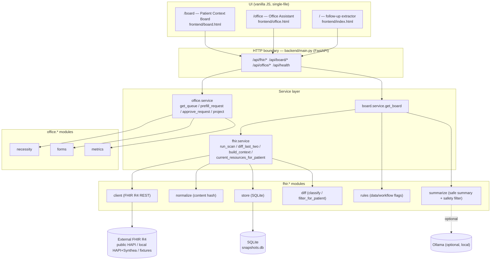
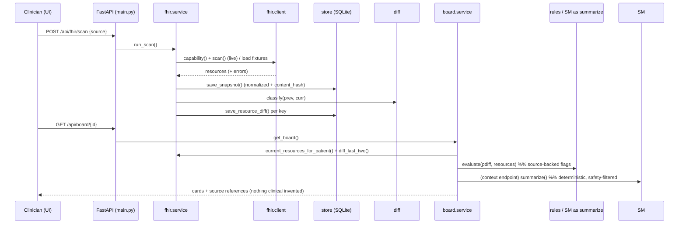

# HealthCare — Design

> Maintainable design of record. Keep it current: when a decision changes, add or
> supersede a `<decision>` block; when a component/endpoint/table changes, update the
> matching table and the `file:LINE` reference. "Built" = present in code today;
> "Planned" = V4 target or roadmap, not yet implemented.

A clinician-defined AI tool for Canadian primary care (COMPASS program). One **modular
monolith**, local-first, **synthetic data only**. Two products on one shared FHIR
substrate: a pre-visit **Patient Context Board** (Direction A) and an admin **Office
Assistant** (Direction B). The AI restates **source-backed** facts only — it never
diagnoses, prescribes, or interprets; the physician approves every clinical output.

## Architecture Overview

**Style:** layered modular monolith — `API → service → modules`; modules never import
the API layer. One architecture quantum (single locally-deployable app, one SQLite store,
synchronous calls). Driving characteristics: **auditability, privacy/locality,
simplicity**. Scalability/performance are explicit non-goals (single-user demo).

<decisions>

<decision name="Python + FastAPI + SQLite + vanilla-JS stack" status="accepted" date="2026-06-20">
**What:** Build on the proven Python reference ("Loop"): FastAPI + Pydantic + SQLite + httpx, single-file vanilla-JS UIs, optional local Ollama. `backend/main.py`, `requirements.txt`.
**Why:** Lean, laptop-deployable, no infra; the reference build already runs offline end-to-end, so the hours buy product, not plumbing.
**Alternatives rejected:** .NET 8 + PostgreSQL + React (the canonical V4 §"production story"); Python + Streamlit (V4 §"final stack"). .NET/React = more work + violates the simplicity/time budget; Streamlit = less control over the calibrated-trust UI than hand-built HTML.
**Trade-offs:** + fastest path, full UI control, reuses tested code. − not the team's primary stack; vanilla-JS has no component framework; .NET/Postgres deferred to the production roadmap.
</decision>

<decision name="FHIR as the single runtime API for the MVP" status="accepted" date="2026-06-20">
**What:** One external API — FHIR R4 REST (`backend/fhir/client.py`), pointed via `FHIR_BASE_URL` (`backend/fhir/service.py:19`) at public HAPI, local HAPI+Synthea, or offline fixtures (`backend/fhir/fixtures/scan_1.json` / `scan_2.json`).
**Why:** Prove the core (pull → snapshot → diff → safe summary) on a real standard API before integrating anything else. Synthetic data only; no PHI.
**Alternatives rejected:** Wiring SMART on FHIR / CDS Hooks / Health Canada DPD-CCDD / MIMIC-IV / MTSamples now — all are V4 roadmap, deferred until the core is proven (tracked ADO AB#615).
**Trade-offs:** + smallest blast radius, one auth/shape to get right. − a multi-source config registry (V4 §18) doesn't exist yet; the "several APIs" have no central home until built.
</decision>

<decision name="Content-hash diff, not versionId/lastUpdated" status="accepted" date="2026-06-20">
**What:** Change detection compares a normalized content hash with volatile meta stripped (`backend/fhir/normalize.py`, `store.content_hash`), classified into new/updated/unchanged/not_returned/error (`backend/fhir/diff.py`, `store.CHANGE_STATUSES` at `store.py:37`).
**Why:** Servers bump `meta.versionId` / `meta.lastUpdated` without content change; hashing the meaningful body gives a reliable, field-level diff. Verified by a test where versionId 1→3 but content identical ⇒ `unchanged`.
**Alternatives rejected:** Trusting `lastUpdated`/`versionId` — produces false "changed" results.
**Trade-offs:** + reliable diff, demo-credible. − must persist the previous snapshot body (storage cost; fine at demo scale).
</decision>

<decision name="Rules are data/workflow rules, not medical rules" status="accepted" date="2026-06-20">
**What:** The rules engine (`backend/fhir/rules.py`) emits structured flags `{ruleId, category, changeStatus, message, source, clinicalInterpretation:null, treatmentRecommendation:null}` (`rules.py:56-67`) — new/updated/not_returned/active_workflow only.
**Why:** Safety. The tool flags *what changed* and *what is open*, never "uncontrolled / order labs / change med." `clinicalInterpretation` is structurally always null; a forbidden-wording guard raises if interpretive text ever appears (`rules.py:41-53`).
**Alternatives rejected:** Care-gap rules that score/severity-rank clinically — crosses the augment-not-replace line.
**Trade-offs:** + auditable, safe, physician keeps judgement. − less "smart"; clinical scoring stays a human task.
</decision>

<decision name="Deterministic builder + safety post-filter for AI summaries" status="accepted" date="2026-06-20">
**What:** Board prose is deterministic by default; an optional local Ollama may rephrase, but its output passes a forbidden-wording filter or is discarded (`backend/fhir/summarize.py:22-27,111-153`). Fail safe, not fail open.
**Why:** The demo must never emit clinical wording or dead-end with no model/network.
**Alternatives rejected:** LLM-only summaries (unsafe + needs a model on stage); cloud LLM (PHI/locality concern, even on synthetic data).
**Trade-offs:** + demo-bulletproof, locality preserved. − deterministic prose is plainer than a model's.
</decision>

<decision name="Lean MVP vs a separate production story" status="accepted" date="2026-06-20">
**What:** No auth, encryption, audit, RBAC, or retention in the MVP; synthetic data only; PHIPA governs real data and is out of scope.
**Why:** Match build depth to a hackathon MVP; these belong to the production roadmap (.NET 8 + PostgreSQL + RBAC/audit/encryption).
**Alternatives rejected:** Building production controls now — wrong investment depth for a kill-gated demo.
**Trade-offs:** + speed. − not deployable against real PHI until the production story is built.
</decision>

</decisions>

## Components

### Components (built — present in code today)
| Component | Responsibility | Key Files |
|---|---|---|
| API boundary | HTTP routes → services | `backend/main.py` |
| fhir.client | Pull patients + resources from a FHIR R4 base; `/metadata`; Bundle paging | `backend/fhir/client.py` |
| fhir.normalize | Content hash with volatile meta stripped; `resource_key`, `patient_ref` | `backend/fhir/normalize.py` |
| fhir.store | SQLite: scan_run / resource_snapshot / resource_diff | `backend/fhir/store.py` |
| fhir.diff | Classify new/updated/unchanged/not_returned; per-patient filter | `backend/fhir/diff.py` |
| fhir.rules | Source-backed data/workflow flags (§15) | `backend/fhir/rules.py` |
| fhir.summarize | Safe deterministic/LLM board summary + safety filter | `backend/fhir/summarize.py` |
| fhir.service | Orchestrate scan → snapshot → diff → context | `backend/fhir/service.py` |
| board.service / cards | Assemble the 3-card Context Board | `backend/board/service.py`, `backend/board/cards.py` |
| office.necessity | Route a request (eliminate/delegate/automate/physician_review) | `backend/office/necessity.py` |
| office.forms | Canonical record + form registry + prefill (clinical fields flagged) | `backend/office/forms.py` |
| office.metrics | Saved-minutes / touchpoints / FTE projection | `backend/office/metrics.py` |
| office.service | Orchestrate triage → prefill → approve(draft+task) → metrics | `backend/office/service.py` |
| UIs | `/board`, `/office`, `/` | `frontend/board.html`, `office.html`, `index.html` |
| UI design system | "Clinical-precision SaaS" tokens (see below) | `frontend/board.html` `:root`, `docs/design/v4-board-ui.md` |

### Components (planned — V4 target, not yet built)
| Component | Change | Key Files (target) |
|---|---|---|
| board.cards | 3-card → **5-card** V4 shape (New/Updated with prev→current + source query; Not-Returned & API Limitations; Source References) | `backend/board/cards.py` |
| Patient Activity List | New Screen-1 endpoint + UI: per-patient counts + data-attention level | `backend/fhir/service.py`, `backend/main.py`, `frontend/board.html` |
| sources config | Config-driven sources registry (FHIR live/local/fixtures + roadmap stubs) — V4 §18 | `config/sources.*` (new) |
| Office UI | Apply the clinical-precision design system to `office.html` for parity | `frontend/office.html` |

## Data Model Changes

SQLite, created/upgraded in `backend/fhir/store.py:40-92` (fresh `CREATE TABLE` + guarded
`ALTER TABLE ADD COLUMN` so old dev DBs upgrade in place). Synthetic data only.

### Entities (built)
- **scan_run** (`store.py:43-48`): `id, source, started_at, resource_count, completed_at, source_base_url, status('running'|'complete'|'error'), error, server_software, fhir_version`.
- **resource_snapshot** (`store.py:49-59`): `id, scan_run_id, resource_key, resource_type, patient_id, version_id, last_updated, content_hash, body`.
- **resource_diff** (`store.py:60-71`): `id, scan_run_id, resource_key, resource_type, patient_id, change_status, diff_json, prev_snapshot_id, curr_snapshot_id, created_at`. `change_status` validated against `CHANGE_STATUSES = (new, updated, unchanged, not_returned, error)` (`store.py:37,164`).
- Indexes: `idx_snap_scan`, `idx_diff_scan` (`store.py:72-73`).

### Migrations
- No ORM/migration tool; `init_db` is idempotent (`CREATE TABLE IF NOT EXISTS` + per-column guarded `ALTER`). `reset()` clears all three tables (`store.py:203-207`). Production (Postgres + real migrations) is roadmap.

## API Design

### Endpoints (built — verified in `backend/main.py`)
| Method | Endpoint | Purpose |
|---|---|---|
| GET | `/`, `/office`, `/board` | Serve the three UIs |
| GET | `/api/health` | model/host/force_mock |
| GET | `/api/samples` · POST `/api/extract` | follow-up extractor |
| GET | `/api/fhir/health` | FHIR base URL |
| POST | `/api/fhir/scan` | `{source, which?, base_url?, patient_count}` → scan summary |
| GET | `/api/fhir/diff` | classify last two scans |
| GET | `/api/fhir/patients` | patients in latest scan |
| GET | `/api/fhir/context/{patient_id}` | safe source-backed context board (rich 5-section shape) |
| POST | `/api/fhir/reset` | clear the snapshot store |
| GET | `/api/board/{patient_id}` | 3-card Patient Context Board |
| GET | `/api/office/requests` | triaged request queue |
| POST | `/api/office/prefill` | `{request_id}` → form prefill |
| POST | `/api/office/approve` | `{request_id, completed_fields}` → draft + follow-up task |
| POST | `/api/office/metrics` | `{processed[]}` → saved-minutes projection |

### Endpoints (planned)
| Method | Endpoint | Change |
|---|---|---|
| GET | `/api/fhir/activity` | New — per-patient change counts + data-attention level (Activity List, V4 §17.1) |
| GET | `/api/board/{id}` | Extend payload to the 5-card V4 shape (prev→current, limitations, sources) |

### UI design system (built — `frontend/board.html` `:root`)
Cool-tinted neutrals + a single teal trust accent (`--teal #0E8A6B`), Inter type, monospace
**source chips** as the provenance signature, subtle depth, generous whitespace. Status =
**label + icon + color** (never color alone). Target WCAG 2.2 AA (4.5:1 text / 3:1 UI).
Full spec + the planned Activity-List + 5-card views: `docs/design/v4-board-ui.md`.

<constraints>

## Security Considerations
- **Synthetic / de-identified data only; no PHI.** Real data is governed by PHIPA and is out of scope for the MVP.
- **No authentication / authorization** in the MVP (single-user, local). RBAC/audit/encryption/retention are the production roadmap.
- **Local-first:** when a model is used it runs on `localhost` (Ollama); no patient data leaves the machine. Treat fetched FHIR content as data, not instructions.

## Performance Considerations
- Single-user demo: SQLite, synchronous calls, no caching needed. Scalability/performance are explicit non-goals.
- Diff cost is bounded by `patient_count` × resource types; content hashing is O(resource size). Bundle paging capped (client follows `link[next]` to a sane page cap).

## Error Handling
- **Live scan failure:** `/metadata` or fetch errors mark the scan run `status='error'` with `error` set (`store.fail_scan_run`, `store.py:144`) and return a clear status rather than raising.
- **`not_returned` ≠ deleted:** absence from a query is reported honestly (`rules.py:117-136`, `summarize` data_source_limitations).
- **AI fail-safe:** any forbidden wording from the optional model ⇒ discard, use deterministic text (`summarize.py:146-153`). Mock/deterministic mode is the default so the demo never dead-ends.

</constraints>

## Data Flow

## Verification status (keep current; updated 2026-06-20)
- **Built + verified (66 pytest green):** FHIR foundation (scan / snapshot / content-hash diff / persisted `resource_diff` / `/metadata` gate / Bundle pagination), rules engine, safe summary, office necessity/prefill/approve/metrics, **5-card Context Board + rules `flags[]`**, **Patient Activity List `GET /api/fhir/activity`**, **config sources registry `config/sources.json` + `GET /api/sources`** (3 active FHIR + 6 roadmap). Live-verified via curl: 5-card board, activity, sources. Office approve flow + board render browser-verified (Playwright). Live FHIR scan/diff/context verified against HAPI.
- **In progress:** the 2-view board UI (Activity List screen + 5-card render, AB#622/624); browser verify both views (AB#625).
- **Accessibility:** palette contrast measured against WCAG 2.2 AA. 3 tokens adjusted to pass (`--faint` #9AA4B2→#697283, `--teal` #0E8A6B→#0C7E61, `--amber` #B45309→#A84A07); being applied to `board.html` + `office.html` + the UI spec.
- **Deferred (roadmap):** SMART on FHIR, CDS Hooks, Health Canada DPD/CCDD, MIMIC-IV, MTSamples, production .NET/PostgreSQL stack (ADO AB#615).
